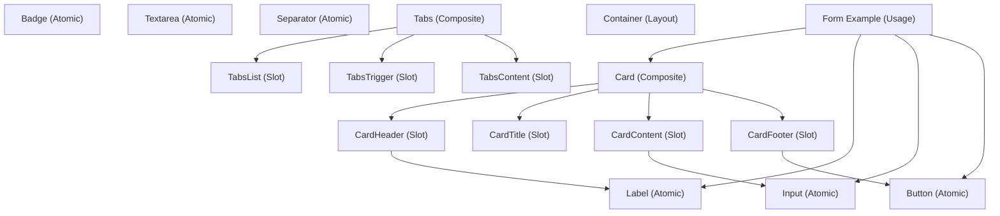

# UI Components Analysis & Architecture

## Component Categorization

### Level 1: Atomic Primitives (No Dependencies)

These are the foundational building blocks that form the basis of all other components.

| Component     | Purpose                     | Props/Variants                      | Dependencies |
| ------------- | --------------------------- | ----------------------------------- | ------------ |
| **Button**    | Primary interactive element | 11 variants, 5 sizes                | None         |
| **Badge**     | Status/category indicator   | 12 semantic variants                | None         |
| **Input**     | Text input field            | type, placeholder, validation attrs | None         |
| **Label**     | Form label                  | for, required                       | None         |
| **Textarea**  | Multi-line text input       | rows, validation attrs              | None         |
| **Separator** | Visual divider              | horizontal/vertical                 | None         |

### Level 2: Composite Components (Built on Level 1)

Components that use basic primitives as building blocks.

| Component | Purpose           | Sub-Components                              | Props                                                                 |
| --------- | ----------------- | ------------------------------------------- | --------------------------------------------------------------------- |
| **Card**  | Content container | Header, Title, Description, Content, Footer | 6 variants (default, elevated, interactive, glass, gradient, outline) |
| **Tabs**  | Tabbed interface  | TabsList, TabsTrigger, TabsContent          | activeTab, activeTabChange event                                      |

### Level 3: Layout & Containers

Components for page structure and spacing.

| Component     | Purpose            | Props                            | Notes                 |
| ------------- | ------------------ | -------------------------------- | --------------------- |
| **Container** | Responsive wrapper | size (sm/md/lg/xl/full), padding | Max-width constraints |

---

## Design Decisions: React → Angular Conversion

### 1. **Component Structure**

**React Approach:**

- Used forwardRef for DOM access
- Merged styled variants with `cva` (class-variance-authority)
- Used Radix UI primitives for accessible components
- Created sub-components as separate exports

**Angular Approach (Non-Standalone):**

- Use `@Input/@Output` decorators instead of props
- Move variant logic into component methods
- Use `@HostBinding` for class application
- Declare all sub-components in shared module
- Utilize Angular's `[ngClass]` for dynamic styling

### 2. **Props → Inputs/Outputs Mapping**

**Button Example:**

```typescript
// React
interface ButtonProps {
  variant?: 'default' | 'destructive' | ...;
  size?: 'default' | 'sm' | ...;
  disabled?: boolean;
  onClick?: (event: MouseEvent) => void;
}

// Angular
@Input() variant: ButtonVariant = 'default';
@Input() disabled: boolean = false;
@Output() clicked = new EventEmitter<MouseEvent>();
```

### 3. **Styling Strategy**

**React:**

- Used Tailwind CSS with `className` props
- Applied variants declaratively with `cva`
- Used Radix UI for behavioral primitives

**Angular:**

- Applied classes via `[ngClass]` binding or `@HostBinding`
- Move variant/size logic into component methods
- Tailwind CSS classes embedded in component TypeScript
- No dependency on external primitive libraries (Radix)

### 4. **Accessibility**

**Preserved from React:**

- ARIA attributes (`aria-selected`, `aria-label`, `role`)
- Focus management
- Keyboard navigation support
- Semantic HTML elements

**Implementation in Angular:**

```typescript
@HostBinding('attr.aria-selected') ariaSelected: boolean;
@HostBinding('role') role: string;
@HostBinding('tabindex') tabIndex: number;
```

### 5. **Content Projection**

**React:** Used `children` prop and `Slot` component

**Angular:** Used `<ng-content>` for flexible content projection

```html
<!-- Parent -->
<app-card>
  <app-card-header>
    <app-card-title>Title</app-card-title>
  </app-card-header>
</app-card>
```

### 6. **Event Handling**

**React:** Click handlers passed via props

```jsx
<button onClick={onClickHandler}>Click</button>
```

**Angular:** EventEmitter pattern with standard event binding

```html
<button (click)="onClickHandler($event)">Click</button>
```

---

## Component Dependencies Map



---

## CSS Class Application Strategy

### Approach 1: String Concatenation (Used)

```typescript
getButtonClasses(): string {
  const baseClasses = '...';
  const variantClasses = this.getVariantClasses();
  const sizeClasses = this.getSizeClasses();
  return `${baseClasses} ${variantClasses} ${sizeClasses}`;
}

// Template
[ngClass]="getButtonClasses()"
```

**Pros:**

- Explicit and typed
- Easy to debug
- Flexible variant selection
- Supports dynamic class generation

**Cons:**

- More method calls
- Larger component code

### Approach 2: HostBinding (Used)

```typescript
@HostBinding('class') get hostClasses(): string {
  return this.getClasses();
}
```

**Pros:**

- Automatic DOM binding
- Reduces template boilerplate
- Cleaner HTML

**Cons:**

- Can't use multiple class bindings
- Less flexible for conditional classes

---

## Variant Value Objects Pattern

Each component with variants maintains a record mapping variant names to CSS classes:

```typescript
private getVariantClasses(): string {
  const variants: Record<ButtonVariant, string> = {
    default: 'bg-primary text-primary-foreground shadow...',
    destructive: 'bg-destructive text-destructive-foreground...',
    // ... more variants
  };
  return variants[this.variant] || variants['default'];
}
```

**Benefits:**

- Type-safe variant selection
- Self-documenting code
- Easy to add/modify variants
- Prevents typos

---

## Form Integration Pattern

### Without Reactive Forms

```html
<app-label for="name" [required]="true">Name</app-label>
<app-input id="name" type="text" [(ngModel)]="formData.name"> </app-input>
```

### With Reactive Forms (Recommended)

```typescript
this.form = this.fb.group({
  name: ['', Validators.required],
});
```

```html
<app-label for="name" [required]="true">Name</app-label>
<app-input id="name" [formControl]="form.get('name')"> </app-input>
<div *ngIf="form.get('name')?.errors?.required" class="text-destructive">Name is required</div>
```

---

## Color Token System

Components use CSS custom properties (variables) for theming:

```scss
// Define in your styles.scss
:root {
  --color-primary: #6d28d9;
  --color-primary-foreground: #ffffff;
  --color-secondary: #e5e7eb;
  --color-secondary-foreground: #1f2937;
  --color-destructive: #ef4444;
  --color-destructive-foreground: #ffffff;
  --color-success: #10b981;
  --color-success-foreground: #ffffff;
  --color-warning: #f59e0b;
  --color-warning-foreground: #ffffff;
  --color-info: #3b82f6;
  --color-info-foreground: #ffffff;
  --color-foreground: #000000;
  --color-background: #ffffff;
  --color-card: #ffffff;
  --color-muted-foreground: #6b7280;
  --color-border: #e5e7eb;
  --color-input: #e5e7eb;
}
```

---

## Comparison: React vs Angular Implementation

### Button Component

**React (Original):**

```jsx
const buttonVariants = cva(
  "inline-flex items-center...",
  {
    variants: { variant: { ... }, size: { ... } }
  }
);

export interface ButtonProps extends React.ButtonHTMLAttributes<HTMLButtonElement> {
  variant?: 'default' | 'destructive' | ...;
  size?: 'default' | 'sm' | ...;
}

const Button = React.forwardRef<HTMLButtonElement, ButtonProps>(
  ({ className, variant, size, asChild = false, ...props }, ref) => {
    const Comp = asChild ? Slot : "button";
    return (
      <Comp className={cn(buttonVariants({ variant, size, className }))} {...props} />
    );
  }
);
```

**Angular (Equivalent):**

```typescript
@Component({
  selector: 'app-button',
  standalone: false,
  templateUrl: './button.component.html',
  styleUrls: ['./button.component.scss'],
})
export class ButtonComponent {
  @Input() variant: ButtonVariant = 'default';
  @Input() size: ButtonSize = 'default';
  @Input() disabled: boolean = false;
  @Output() clicked = new EventEmitter<MouseEvent>();

  getButtonClasses(): string {
    return `${baseClasses} ${this.getVariantClasses()} ${this.getSizeClasses()}`;
  }

  private getVariantClasses(): string {
    const variants: Record<ButtonVariant, string> = {
      /* ... */
    };
    return variants[this.variant];
  }
}
```

**Key Differences:**
| Aspect | React | Angular |
|--------|-------|---------|
| Props | Interface & destructuring | @Input decorators |
| Variants | CVA library | Component methods |
| Refs | forwardRef | Template variables |
| Events | onClick prop | @Output EventEmitter |
| Styling | className prop | @HostBinding + [ngClass] |
| Content | children prop | ng-content |

---

## Extensibility & Future Enhancements

### Adding New Components

1. Create directory: `src/app/modules/shared/components/ui/component-name/`
2. Create three files:
   - `component-name.component.ts` - Logic & inputs
   - `component-name.component.html` - Template with ng-content
   - `component-name.component.scss` - Styling
3. Import in `SharedModule` declarations & exports
4. Document in `UI_LIBRARY.md`

### Adding New Variants

```typescript
// In component.ts
private getVariantClasses(): string {
  const variants: Record<ComponentVariant, string> = {
    // ... existing variants
    'new-variant': 'class-a class-b class-c',
  };
  return variants[this.variant];
}

// Update type
export type ComponentVariant = 'existing' | 'new-variant';

// Update @Input
@Input() variant: ComponentVariant = 'existing';
```

---

## Testing Strategy

### Unit Test Example (Button)

```typescript
describe('ButtonComponent', () => {
  it('should emit clicked event on click', () => {
    const component = fixture.componentInstance;
    spyOn(component.clicked, 'emit');

    const button = fixture.nativeElement.querySelector('button');
    button.click();

    expect(component.clicked.emit).toHaveBeenCalled();
  });

  it('should apply correct classes for variant', () => {
    component.variant = 'destructive';
    fixture.detectChanges();

    const button = fixture.nativeElement.querySelector('button');
    expect(button.classList.contains('bg-destructive')).toBeTruthy();
  });
});
```

---

## Performance Considerations

1. **Change Detection**: Default strategy is sufficient for atomic components
2. **NgClass**: Applied to host element (efficient)
3. **Content Projection**: No performance impact
4. **Event Binding**: Direct EventEmitter (no memory leaks)
5. **No External Dependencies**: Radix UI/CVA replaced with pure Angular

---

## Accessibility Checklist

- [x] Semantic HTML (button, input, label, div)
- [x] ARIA attributes (aria-selected, aria-label, role)
- [x] Keyboard navigation support
- [x] Focus management
- [x] Color contrast (Tailwind default)
- [x] Screen reader friendly
- [ ] Testing with NVDA/JAWS (Future)
- [ ] WCAG 2.1 AA compliance (Target)
